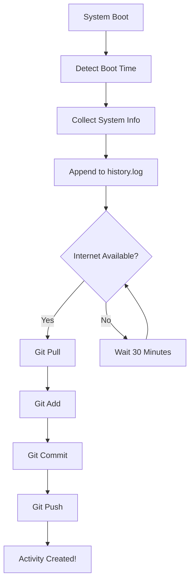

# GitHub Daily Activity

<p align="center">
  
  
  
  
</p>

<p align="center">
  <strong>Automatically record system boots and create GitHub contributions</strong>
</p>

<p align="center">
  <a href="#features">Features</a> •
  <a href="#installation">Installation</a> •
  <a href="#quick-start">Quick Start</a> •
  <a href="#documentation">Documentation</a> •
  <a href="#contributing">Contributing</a> •
  <a href="#license">License</a>
</p>

---

## Overview

GitHub Daily Activity is a Linux automation tool that automatically records every system boot and creates a GitHub contribution by committing and pushing boot history to your repository.

### How It Works



## Features

- **Automatic Boot Detection** - Detects system boot using `who -b`
- **System Information Collection** - Gathers hostname, OS, kernel, CPU, RAM, IP, and more
- **SSH Authentication** - Secure push using SSH keys only (no passwords or tokens)
- **Internet Retry System** - Waits for internet connectivity with configurable retry interval
- **Systemd Integration** - Runs as a systemd service, not cron
- **Auto Branch Detection** - Automatically detects `main` or `master` branch
- **Safe Git Operations** - Pull before push, retry failed pushes
- **Comprehensive Logging** - Activity, error, and system logs
- **Multiple Commands** - Status, debug, version, and dry-run modes
- **Error Handling** - Never crashes, handles all error scenarios gracefully

## Supported Systems

| System | Status |
|--------|--------|
| Ubuntu 22.04+ | Supported |
| Ubuntu 24.04+ | Supported |
| Debian 11+ | Supported |
| Linux Mint 21+ | Supported |
| Pop!_OS 22.04+ | Supported |

## Installation

### Prerequisites

1. **SSH Key** configured for GitHub:
   ```bash
   ssh-keygen -t ed25519 -C "your_email@example.com"
   eval "$(ssh-agent -s)"
   ssh-add ~/.ssh/id_ed25519
   # Add public key to GitHub
   ```

2. **Git** installed:
   ```bash
   sudo apt install git
   ```

### Install

```bash
# Clone the repository
git clone https://github.com/SamanQasempour/github-daily-activity.git

# Navigate to directory
cd github-daily-activity

# Make installer executable
chmod +x install.sh

# Run installer
sudo ./install.sh
```

## Quick Start

After installation, the service will run automatically on every boot. To test without rebooting:

```bash
# Preview what will be recorded (dry-run)
sudo /opt/github-daily-activity/boot-log.sh --dry-run

# Run the boot activity manually
sudo /opt/github-daily-activity/boot-log.sh

# Check status
sudo /opt/github-daily-activity/boot-log.sh --status
```

## Commands

| Command | Description |
|---------|-------------|
| `--status` | Show current status of service and repository |
| `--debug` | Enable debug mode with verbose output |
| `--version` | Show version information |
| `--dry-run` | Preview without making any changes |
| `--help` | Show help message |

## Configuration

Edit `/opt/github-daily-activity/config.conf` to customize behavior:

```bash
# Retry interval in seconds (default: 1800 = 30 minutes)
RETRY_INTERVAL=1800

# Enable/disable features
ENABLE_PUBLIC_IP=true
ENABLE_PULL=true
ENABLE_PUSH=true
ENABLE_COMMIT=true

# Log level: DEBUG, INFO, WARN, ERROR
LOG_LEVEL=INFO

# Branch detection: AUTO, main, master
BRANCH=AUTO
```

See [docs/CONFIGURATION.md](docs/CONFIGURATION.md) for all options.

## Systemd Service

```bash
# Check service status
sudo systemctl status github-daily-activity

# Restart service
sudo systemctl restart github-daily-activity

# Stop service
sudo systemctl stop github-daily-activity

# View logs
journalctl -u github-daily-activity

# Disable service
sudo systemctl disable github-daily-activity
```

## Documentation

| Document | Description |
|----------|-------------|
| [Quick Start](docs/QUICK_START.md) | Get started in 5 minutes |
| [Installation](docs/INSTALL.md) | Detailed installation guide |
| [Configuration](docs/CONFIGURATION.md) | All configuration options |
| [How It Works](docs/HOW_IT_WORKS.md) | Technical overview |
| [Systemd](docs/SYSTEMD.md) | Service management |
| [SSH Setup](docs/SSH_SETUP.md) | SSH key configuration |
| [Troubleshooting](docs/TROUBLESHOOTING.md) | Common issues and fixes |
| [FAQ](docs/FAQ.md) | Frequently asked questions |
| [Knowledge Base](docs/KNOWLEDGE_BASE.md) | Deep dive into architecture |
| [Project Structure](docs/PROJECT_STRUCTURE.md) | File organization |
| [Logging](docs/LOGGING.md) | Log files explained |
| [Development](docs/DEVELOPMENT.md) | Development guide |
| [Testing](docs/TESTING.md) | Testing procedures |
| [Release](docs/RELEASE.md) | Release process |
| [Roadmap](docs/ROADMAP.md) | Future plans |
| [Security](SECURITY.md) | Security policy |

## Project Structure

```
github-daily-activity/
├── README.md                    # This file
├── LICENSE                      # MIT License
├── CHANGELOG.md                 # Version history
├── CONTRIBUTING.md              # Contribution guidelines
├── SECURITY.md                  # Security policy
├── install.sh                   # Installation script
├── uninstall.sh                 # Uninstallation script
├── boot-log.sh                  # Main boot logging script
├── config.conf                  # Configuration file
├── .gitignore                   # Git ignore rules
├── systemd/
│   └── github-daily-activity.service
├── docs/
│   ├── INDEX.md
│   ├── INSTALL.md
│   ├── QUICK_START.md
│   └── ... (more docs)
└── .github/
    ├── workflows/
    │   └── shellcheck.yml
    ├── ISSUE_TEMPLATE/
    │   ├── bug_report.md
    │   └── feature_request.md
    ├── PULL_REQUEST_TEMPLATE.md
    └── CODE_OF_CONDUCT.md
```

## Boot Entry Format

Each boot creates an entry in `history.log`:

```
========================================
Boot Time:
2024-01-15 09:30:45

Hostname:
my-laptop

Username:
saman

OS:
Ubuntu 22.04.3 LTS

Kernel:
5.15.0-91-generic

Architecture:
x86_64

CPU:
Intel(R) Core(TM) i7-10700K CPU @ 3.80GHz

RAM:
16G

IP Address:
203.0.113.42

Timezone:
Asia/Tehran

Uptime:
up 2 hours, 15 minutes

Git Branch:
main

Repository:
/opt/github-daily-activity

========================================
```

## Architecture

```mermaid
flowchart LR
    subgraph System
        A[Boot Event]
        B[systemd]
        C[boot-log.sh]
    end
    
    subgraph Collection
        D[who -b]
        E[hostnamectl]
        F[/proc/cpuinfo]
        G[free -h]
        H[curl ifconfig.me]
    end
    
    subgraph Git
        I[git pull]
        J[git add]
        K[git commit]
        L[git push]
    end
    
    A --> B
    B --> C
    C --> D
    C --> E
    C --> F
    C --> G
    C --> H
    C --> I
    I --> J
    J --> K
    K --> L
```

## Uninstallation

```bash
# Run uninstaller
sudo ./uninstall.sh
```

The uninstaller will:
- Stop and disable the systemd service
- Remove installed files
- Keep your git repository intact

## Contributing

Contributions are welcome! Please see [CONTRIBUTING.md](CONTRIBUTING.md) for guidelines.

## Security

For security concerns, please see [SECURITY.md](SECURITY.md).

## License

This project is licensed under the MIT License - see the [LICENSE](LICENSE) file for details.

## Author

**SamanQasempour**
- GitHub: [@SamanQasempour](https://github.com/SamanQasempour)
- Email: samann1389@gmail.com

## Acknowledgments

- Thanks to all contributors
- Inspired by GitHub contribution graphs
- Built with Bash and systemd
