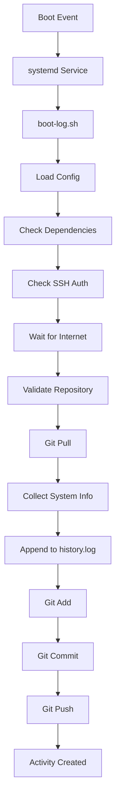
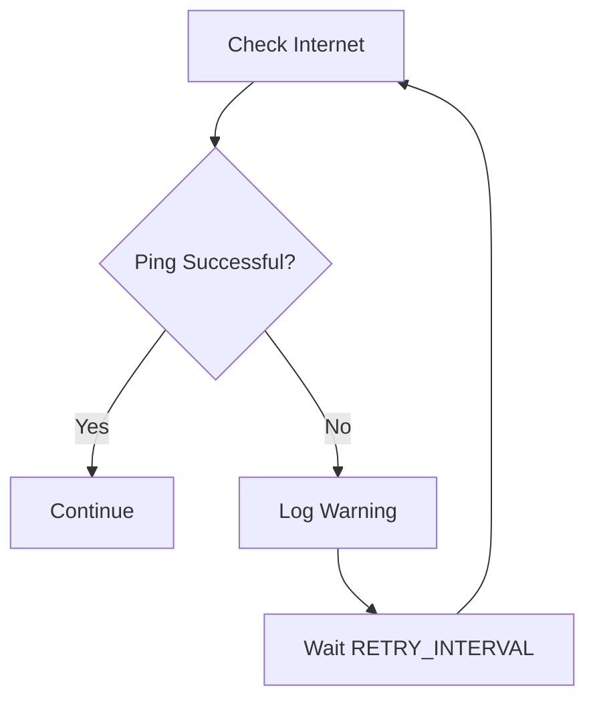
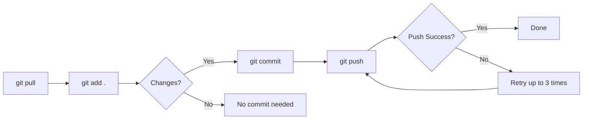

# How It Works

Technical overview of GitHub Daily Activity.

## Architecture



## Boot Detection

The script uses `who -b` to detect the last boot time:

```bash
who -b
# Output: system boot  2024-01-15 09:30
```

If unavailable, it falls back to the current timestamp.

## System Information Collection

| Information | Command | Fallback |
|-------------|---------|----------|
| Boot Time | `who -b` | `date` |
| Hostname | `hostname` | `Unknown` |
| Username | `whoami` | `Unknown` |
| OS | `/etc/os-release` | `lsb_release` |
| Kernel | `uname -r` | `Unknown` |
| Architecture | `uname -m` | `Unknown` |
| CPU | `/proc/cpuinfo` | `Unknown` |
| RAM | `free -h` | `Unknown` |
| IP Address | `curl ifconfig.me` | Local IP |
| Timezone | `timedatectl` | `Unknown` |
| Uptime | `uptime -p` | `Unknown` |

## Internet Retry System



Default retry interval: 1800 seconds (30 minutes)

## Git Workflow



## Branch Detection

Automatic branch detection:

1. Check if `main` branch exists locally
2. Check if `master` branch exists locally
3. Check remote HEAD reference
4. Default to `main` if all else fails

## Error Handling

The script handles:

- Missing dependencies
- SSH authentication failure
- Internet unavailability
- Repository validation failure
- Git pull failure
- Git commit failure
- Git push failure

Errors are logged to `error.log` and the script continues running.

## Logging System

### activity.log
Normal operations and status messages.

### error.log
Error messages and failure details.

### system.log
System events and lifecycle information.

All logs include timestamps in format: `YYYY-MM-DD HH:MM:SS`
