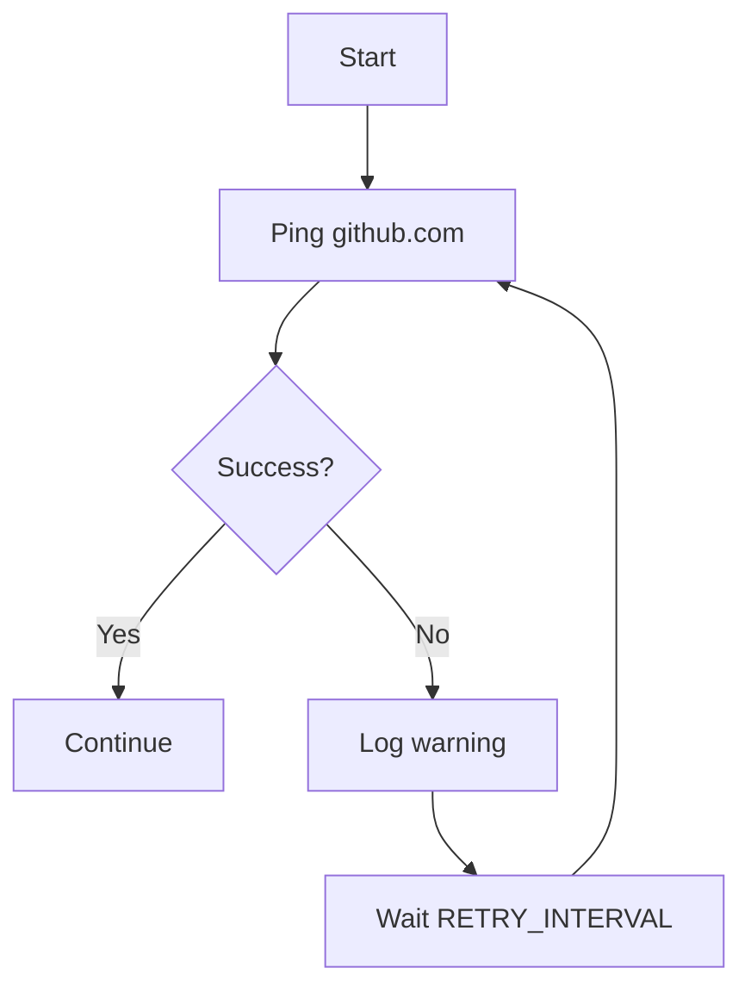
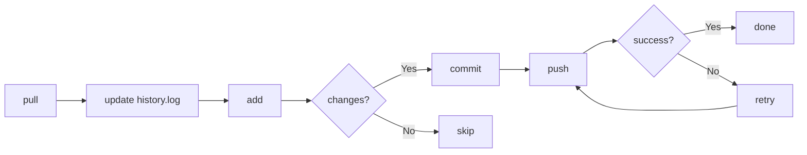
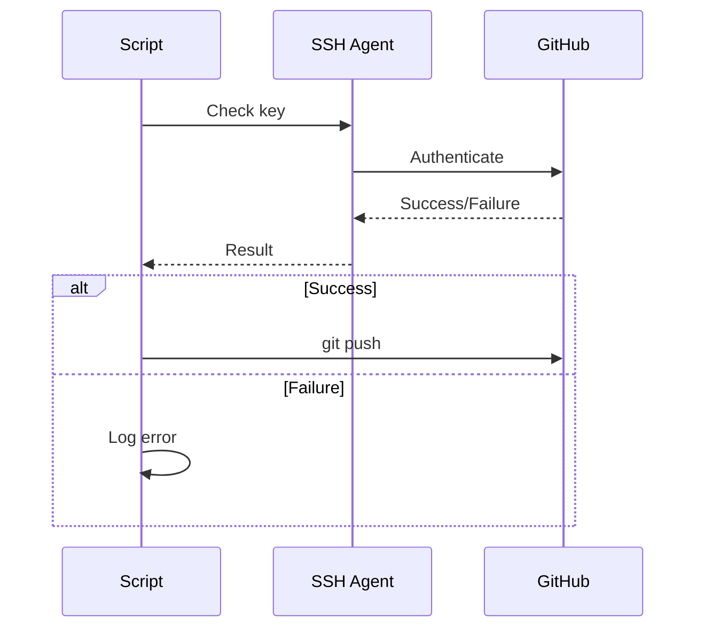

# Knowledge Base

Deep dive into GitHub Daily Activity architecture and design decisions.

## Why This Project Exists

Many developers want to maintain consistent GitHub contribution graphs. GitHub Daily Activity automates this by recording system boots as contributions.

### Key Benefits

- **Automatic**: No manual action required after installation
- **Reliable**: Systemd ensures service runs on every boot
- **Secure**: SSH-only authentication
- **Resilient**: Never loses data, retries failed operations
- **Transparent**: Complete logging of all operations

## Architecture Decisions

### Why Systemd Instead of Cron?

| Aspect | Systemd | Cron |
|--------|---------|------|
| Boot timing | Guaranteed after network | May run before network |
| Dependency management | Built-in (network.target) | Manual |
| Logging | Integrated (journalctl) | Separate setup |
| Service management | Start/stop/restart/status | Limited |
| Error handling | Automatic restart | Manual |
| Modern Linux | Standard | Legacy |

**Decision**: Systemd provides better integration with modern Linux systems.

### Why SSH Instead of HTTPS?

| Aspect | SSH | HTTPS |
|--------|-----|-------|
| Security | Key-based | Token-based |
| Convenience | Set once | Token management |
| Storage | No secrets in files | Risk of exposure |
| Industry standard | Best practice | Common but less secure |

**Decision**: SSH is more secure and convenient for automation.

### Why Bash Instead of Python/Other?

| Aspect | Bash | Python |
|--------|------|--------|
| Dependencies | Minimal | Requires installation |
| System integration | Native | Additional layer |
| Learning curve | Lower for Linux admins | Higher |
| Portability | Linux standard | Cross-platform |

**Decision**: Bash is native to Linux and requires no additional dependencies.

## Technical Deep Dive

### Boot Detection

```bash
# Primary method
who -b
# Output: system boot  2024-01-15 09:30

# Fallback
date
```

The script uses `who -b` because:
- Directly queries system boot records
- More accurate than alternative methods
- Available on all supported systems

### System Information Collection

Each piece of information has a primary method and fallback:

```bash
# Example: CPU information
# Primary: /proc/cpuinfo
# Fallback: lscpu
# Final fallback: Unknown
```

### Internet Retry Mechanism



**Design choices:**
- Ping github.com (always available)
- Configurable interval (default: 30 min)
- Infinite retries (never gives up)
- Data saved locally (no loss)

### Git Workflow



**Key points:**
- Pull before push (avoid conflicts)
- Check for changes (avoid empty commits)
- Retry mechanism (3 attempts)
- Branch auto-detection

### Error Handling Philosophy

The script follows these principles:

1. **Never crash**: All errors are caught
2. **Log everything**: Complete audit trail
3. **Retry when possible**: Network, push operations
4. **Graceful degradation**: Continue without non-essential features
5. **User notification**: Clear error messages

## Security Model

### Authentication Flow



### Data Privacy

**Collected:**
- System information (hostname, OS, kernel, etc.)
- IP address (optional)
- Boot timestamps

**Not collected:**
- Personal files
- Passwords
- API tokens
- Browsing history

**Storage:**
- Local files only
- Your repository only
- No external services

## Performance Considerations

### Boot Time Impact

The script:
- Runs after network is available (non-blocking)
- Uses `Type=oneshot` (runs once, then exits)
- Minimal resource usage
- No background processes

### Network Usage

- Single ping for internet check
- Small git operations
- No continuous connections
- Configurable intervals

## Future Improvements

See [ROADMAP.md](ROADMAP.md) for planned features.

### Potential Enhancements

1. **Webhook notifications**: Notify on successful push
2. **Statistics dashboard**: View boot patterns
3. **Multiple repositories**: Push to multiple repos
4. **Custom templates**: Personalized boot entries
5. **GUI configuration**: Desktop app for settings
